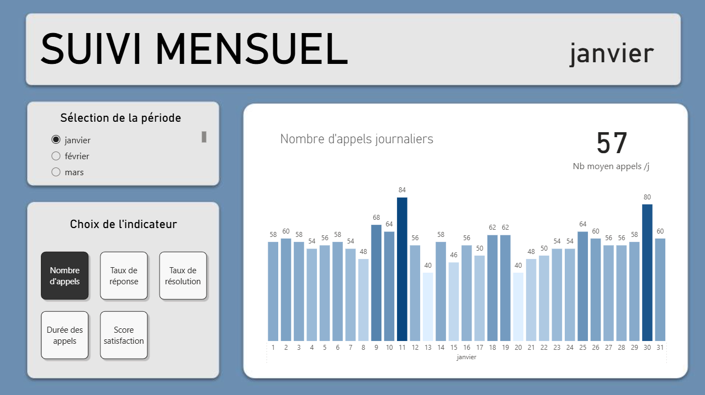
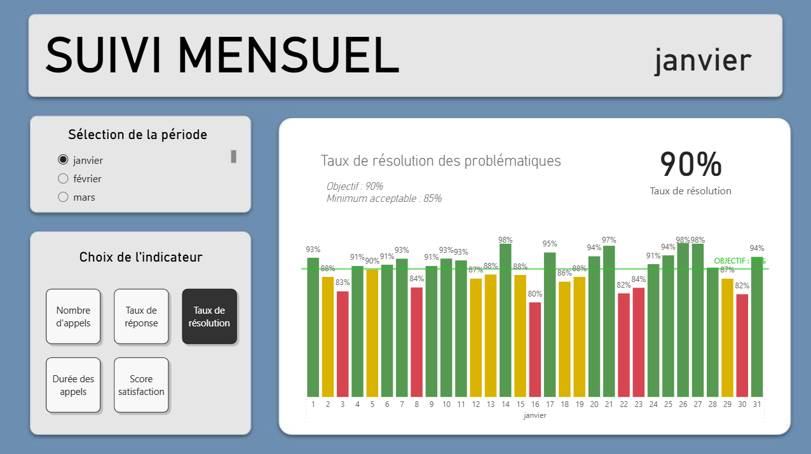
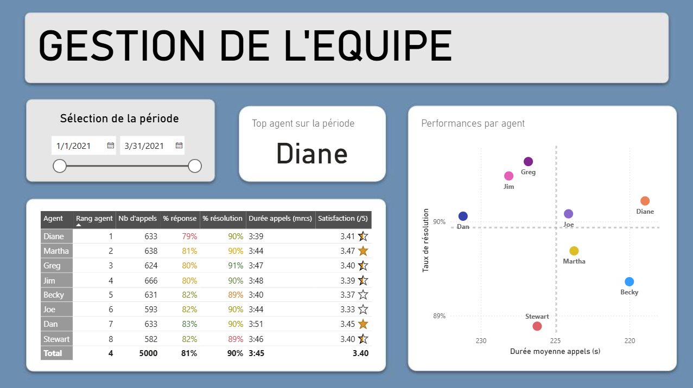
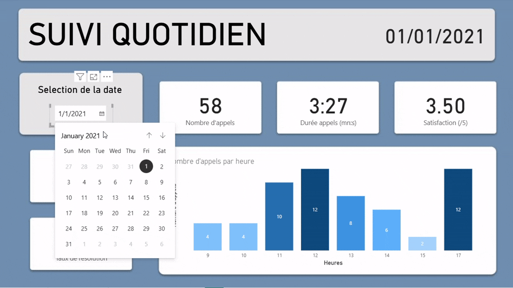
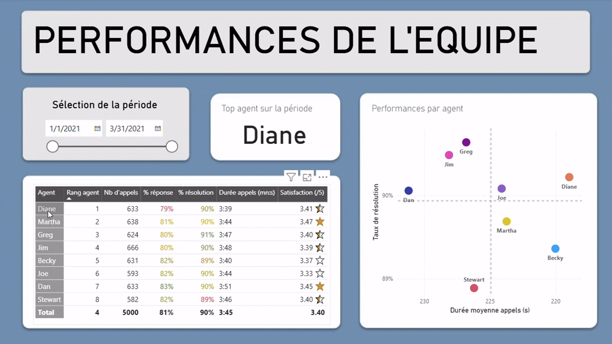

> ⚡ **Project Overview (EN)**
> Interactive Power BI dashboard for a call center.
> The dashboard is in **French** and includes daily KPIs, monthly trends, and team performance.

---

# 📞 Power BI Dashboard – Call Center Performance
**Call Center Dashboard** est un tableau de bord interactif réalisé sur **Power BI**, permettant d’analyser les performances d’un centre d’appel fictif.
Il permet une vision à la fois **quotidienne, mensuelle et individuelle** de l’activité, afin de suivre les indicateurs clés, identifier les tendances et évaluer les performances des équipes.

---

## 👉 Les objectifs

- Fournir une **vue claire et synthétique** de la performance du centre d’appel
- Identifier rapidement les **périodes de forte ou faible activité**
- Mettre en évidence les **meilleurs agents** et les leviers d’amélioration

### 📌​ Structure du dashboard

Le rapport Power BI est structuré en **3 pages** principales :

1. **Suivi quotidien** – Visualisation des **KPI journaliers** : nombre d’appels, durée moyenne des appels, taux de réponse aux appels, taux de résolutiondes problèmes, satisfaction client (note /5).
2. **Tendances mensuelles** – Suivi des **indicateurs agrégés par mois** ainsi que leur évolution au cours du mois. Comparaison à des objectifs et analyse de la tendance.
3. **Performance des équipes** – Analyse **individuelle** des agents : taux de résolution, efficacité et satisfaction. Préconisations d'amélioration des performances individuelles (pertinence ou rapidité).

| Page 1 | Page 2 | Page 3 |
|--------|--------|--------|
|  |  |  |

### 🔎​ Visualisation

- Visualisations **interactives** et filtrables
- Indicateurs de performance clairs et **colorimétrie** cohérente
- Mise en page ergonomique et **design moderne**

---

## Eléments techniques

### 📂 Dataset
- Source des données : [Kaggle Telecom Company Dataset](https://www.kaggle.com/datasets/datazng/telecom-company-churn-rate-call-center-data)
- Données simulées, chaque ligne correspondant à un appel avec les données suivantes :
  - Agent en charge
  - Date
  - Heure
  - Réponse à l'appel (oui/non)
  - Résolution du problème (oui/non)
  - Durée de l'appel
  - Note de satisfaction (/5)

### 🛠️ Outils utilisés

| Type | Outil / Langage |
|------|-----------------|
| Visualisation | **Power BI Desktop** |
| Préparation des données | **Power Query** |
| Calculs et mesures | **DAX** |
| Source de données | **Excel (.xlsx)** |

---

## 📽️ Aperçu du dashboard
**Page 1 – Suivi quotidien**

**Page 2 – Tendances mensuelles**

**Page 3 – Équipes et performance**

---

## Utilisation
1. Télécharger le fichier Power BI : **Dashboard call center.pbix**
2. Ouvrir le fichier avec Power BI Desktop
3. Explorer les trois pages du rapport via le menu de navigation intégré
